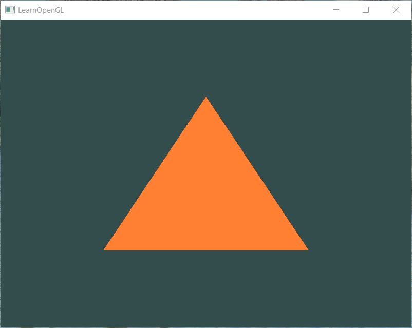
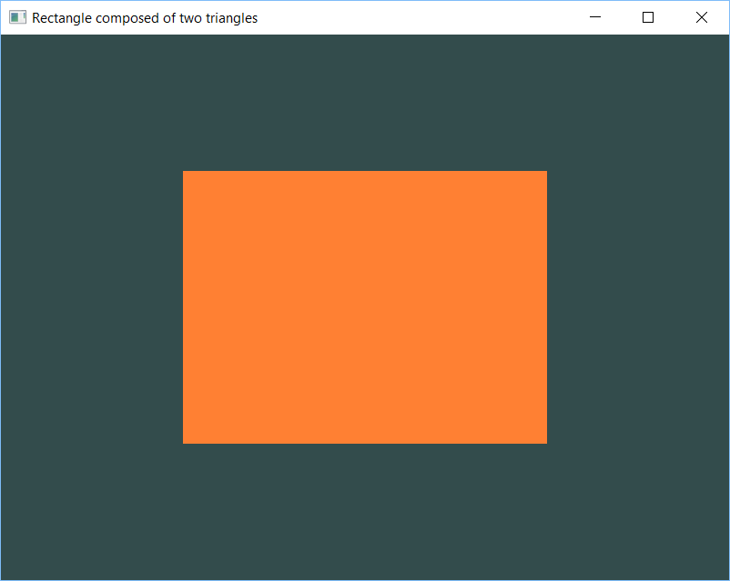
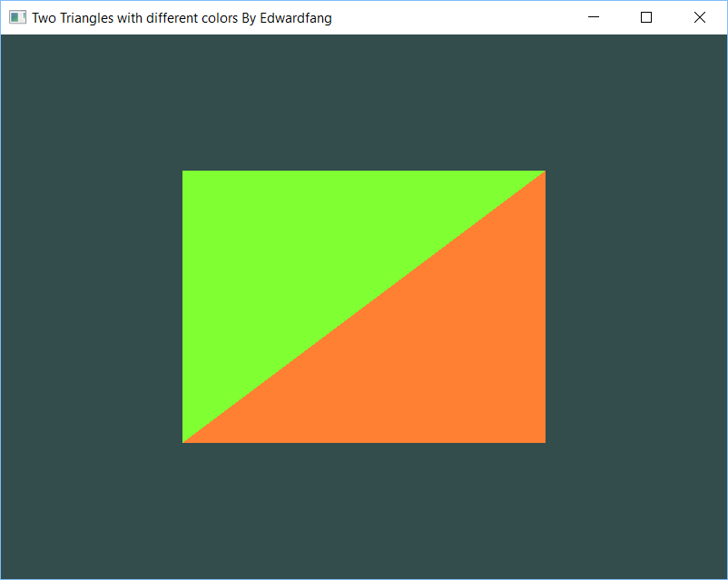
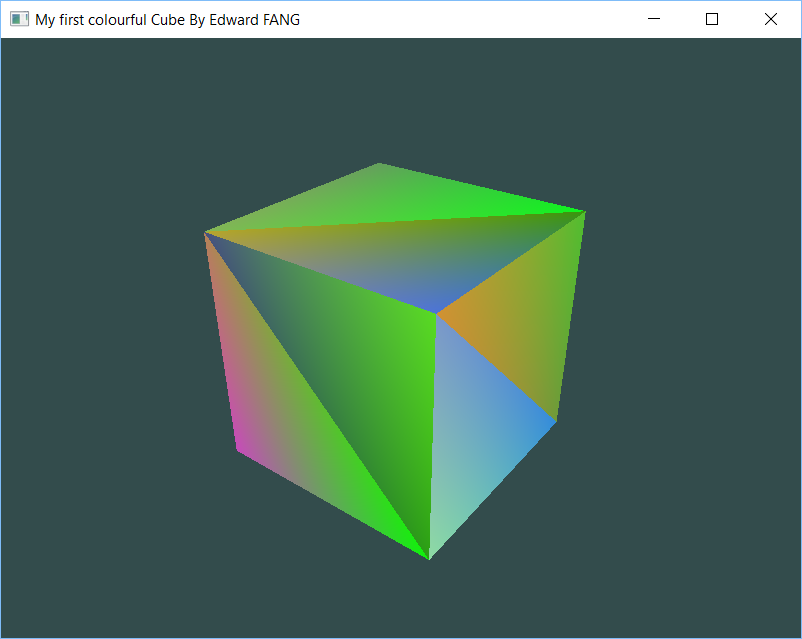

# SUSTech CS312 Computer Graphics

This repository is used to store the code we practise in the CS312's Lab.

## Development Environment

Visual Studio 2017

## Lab 01 Just an windows for the playground of OpenGL

 - In the `Hello_CG` project
 - the project needs to include `Libs` and `Includes` at root directory
 - the project needs to include `opengl32.lib` and `glfw3.lib`

## Lab 02 VAO/VBO/EBO and shader; More about rendering
 - referance: https://learnopengl-cn.github.io/01%20Getting%20started/05%20Shaders/
 

